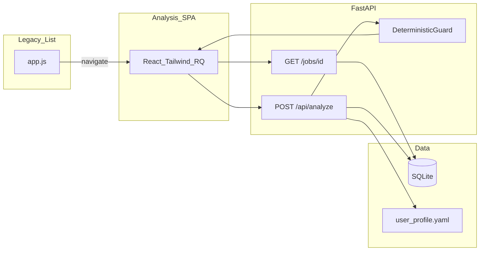

# Job-Hunter 2.0：Agentic Bridge（含 Analyze 大脑与 React 分析页）

本文档为仓库内**唯一落地的开发计划**（与 Cursor 计划同步时，以本文件与已实现代码为准）。  
栈：**FastAPI**、**SQLite**、`user_profile.yaml`、**Vite + React + Tailwind + TanStack Query**（分析页）、现有静态列表仪表盘。

---

## 实施任务清单（摘要）

| 阶段 | 内容 |
|------|------|
| Phase 0 | Node `scripts/test-analyze.ts`：真实 JD + profile + resumes，迭代 Prompt |
| Phase 1 | `GET /jobs/{id}`、`POST /api/analyze`（Mock + Pydantic + **Guard**）、React `/job/{id}/analysis`、FastAPI 挂载 SPA、列表跳转 |
| Phase 2 | YAML `resumes[]`、Prompt 注入、可选 `recommended_resume_reason`、可选 SQLite 缓存、可选 Supabase |
| Phase 3 | `POST /api/optimize`（Writer → Critic）、SSE、双栏编辑、Monaco/Diff/Explain（分期） |
| Phase 4 | 列表 Analyze 分数列、Priority Apply、PDF 导出 |
| 全程 | pytest、README、环境变量与 Mock 说明 |

---

## 核心原则：认知大脑 + 可控性层

- **Analyze（认知层）**：LLM 根据 JD / profile / resumes 产出**原始结构化判断**（score、dimensions、decision、strengths、gaps、strategy、confidence、简历路由等）。Prompt + JSON Schema 是**认知输出契约**。
- **Strategy Engine / Guard（轻逻辑层）**：Pydantic 校验之后执行 **Deterministic Guard**（确定性规则）：修正自相矛盾、非法 `resume_id`、与阈值不一致的 `decision`；列表排序与 Priority 规则也可放此层，避免全绑在 LLM 输出上。
- **执行型能力**（Optimize、Ranking、未来的 Auto-apply）：消费 **经 Guard 后的** DTO，与 Analyze **解耦**。

**数据流（强制）**

`LLM → JSON → Pydantic（认知 Schema）→ Deterministic Guard → API 响应 DTO → UI`

**产品闭环**：`Job → Analyze → 推荐 Resume A → Optimize(A) 对齐 JD → Apply`。

---

## 权威：核心决策 Prompt 与 JSON Schema

**占位符**

- `{{job_content}}`：完整 JD（建议上限约 12k 字符，与现有流水线截断策略对齐）。
- `{{user_profile}}`：YAML `profile` 的 JSON 序列化。
- `{{resumes_list}}`：JSON 数组，每项 `{ "id", "content" }`。

**母版 Prompt（指令块）**

```markdown
# Role
你是一位拥有 20 年经验的技术猎头和工程总监，擅长挖掘候选人的跨学科潜力（PhD/Academic + CS Engineering）。

# Task
基于提供的 [岗位详情(JD)]、[用户核心背景] 和 [简历库]，进行深度匹配分析并给出投递决策。

# Inputs
- Job Description: {{job_content}}
- User Core Profile: {{user_profile}} (包含 PhD 背景, 播客影响力, ROS2 等核心元数据)
- Resumes: {{resumes_list}} (数组形式，包含 id 和 content)

# Constraints
1. **真实性原则**：禁止虚构任何用户未提及的技能或经历。
2. **简历路由**：必须从提供的 Resumes 列表中选择最合适的一个；若列表为空或仅一项，仍须合法输出 `recommended_resume_id`（空列表时约定见 API/Guard）。
3. **输出格式**：严禁任何解释性文字、Markdown 代码围栏或前后缀，只输出符合 Schema 的标准 JSON。
4. **叙事感（Strengths）**：`strengths` 每条用完整、可读句子；避免干瘪关键词堆叠；须遵守真实性原则。
5. **评估维度**（模型内部校准）：
   - Hard Skill Match：技术栈与 JD 对齐度。
   - Experience Match：职业阶段与职级匹配度。
   - Synergy Match：PhD/研究/传播等对岗位的增量价值（前端展示标签 **Leverage**，与 synergy 同义）。
6. **置信度**：输出 `confidence`（HIGH | MEDIUM | LOW），反映证据充分性与匹配确定性。

# Output JSON Schema
{
  "score": number,
  "dimensions": {
    "hard_skills": number,
    "experience": number,
    "synergy": number
  },
  "decision": "APPLY" | "SKIP" | "STRETCH",
  "confidence": "HIGH" | "MEDIUM" | "LOW",
  "strengths": string[],
  "gaps": string[],
  "recommended_resume_id": "string",
  "strategy": {
    "focus": "string",
    "key_message": "string",
    "risk": "string"
  }
}
```

**Pydantic 约束**

| 字段 | 规则 |
|------|------|
| `score` | 整数 0–100 |
| `dimensions.*` | 0–100；键名 `hard_skills` / `experience` / `synergy` |
| `decision` | `APPLY` \| `SKIP` \| `STRETCH` |
| `confidence` | `HIGH` \| `MEDIUM` \| `LOW` |
| `strengths` | 最多 3 条 |
| `gaps` | 最多 2 条 |
| `recommended_resume_id` | ∈ 输入 `resumes_list[].id`；空列表与 Guard 约定一致 |
| `strategy.focus` | 短标签，如 backend / research / fullstack |
| `strategy.key_message` | 投递主叙事 |
| `strategy.risk` | 主要风险或需圆场点 |

**Deterministic Guard（示例规则，阈值可配置）**

| 场景 | 规则 |
|------|------|
| 高分与差距矛盾 | `len(gaps) >= 2` 且 `score > 85` → 压分（如 cap 80） |
| decision 与 score 不一致 | 如 `score < 65` 且 `decision == APPLY` → 改为 `SKIP` 或 `STRETCH`（产品定） |
| 非法 `recommended_resume_id` | fallback 至第一份简历 id，或 `""` 并限制 `confidence` |

可选响应字段：`guard_adjusted`、`guard_notes`（调试用）。

**UI 约定**

- Badge 文案：APPLY → **Strong Fit**；STRETCH → **High Potential**；SKIP → **Low Fit**。
- 雷达轴：**Skills**、**Experience**、**Leverage**（对应上述三个 dimension 键）。

---

## Phase 0：`test-analyze.ts`

- 仓库内 Node 脚本，输入真实 JD / 简历 / profile，输出与生产相同 Schema。
- 不替代 pytest。

---

## Phase 1：决策闭环

**后端**

- `GET /jobs/{id}`：含完整 `description`。
- `POST /api/analyze`：`job_id`、`force_refresh`（可选）；LLM → Pydantic → Guard；Mock 开关。
- 不修改流水线 `score_job` 的语义（除非后续刻意统一标尺）。

**前端**

- Vite + React + Tailwind + `@tanstack/react-query`。
- `/job/{id}/analysis`：岗位 query + analyze mutation/query；LoadingVibe；决策栏；雷达；Strengths/Gaps；简历卡片；Optimize 占位。
- build → `app/static/analysis/`；FastAPI 返回 SPA `index.html`；`app/static/app.js` 跳转分析页。

---

## Phase 2：简历路由与持久化

- `user_profile.yaml` 中 `resumes[]` → `{{resumes_list}}`。
- 可选：`recommended_resume_reason`（与 `strategy` 分工）。
- 可选：SQLite `job_analyses` 缓存；可选 Supabase。

---

## Phase 3–4

- **Optimize**：Writer → Critic；YAML `verified_skills` / `never_claim`；SSE。
- **编辑器**：Monaco、Diff、Explain（分期）。
- **列表**：Analyze 分数字段、排序、Priority Apply；PDF 导出。

---

## 架构示意



---

## Day-by-day（约 22 个工作日）

**假设**：每周 5 个工作日；可兼职折算。

### 第 1 周 — Phase 1 后端与脚手架

| 天 | 主题 | 交付物 |
|----|------|--------|
| **D1** | 契约与单条岗位 | `AnalyzeResult` Pydantic（含 confidence、结构化 strategy、dimensions）；`GET /jobs/{job_id}`；pytest |
| **D2** | Mock + Guard | `POST /api/analyze` Mock；Deterministic Guard 首批规则；pytest 含矛盾样例 |
| **D3** | Prompt 组装 + Node 脚本 | 变量注入模块；`scripts/test-analyze.ts` |
| **D4** | 真实 LLM | Gemini/OpenAI（可选 Anthropic）；JSON 模式；重试与错误响应 |
| **D5** | React 脚手架 | Vite+React+Tailwind+RQ；解析 `job_id`；LoadingVibe；拉 `GET /jobs/{id}` |

### 第 2 周 — Phase 1 UI 与集成

| 天 | 主题 | 交付物 |
|----|------|--------|
| **D6** | 决策栏 | score、产品化 Badge、confidence；标题公司来自 job API |
| **D7** | 雷达与列表区 | Skills/Experience/Leverage；Strengths/Gaps；STRETCH tooltip |
| **D8** | 简历卡片 | `recommended_resume_id` + strategy 三字段；Optimize 占位 |
| **D9** | 挂载与跳转 | build 静态资源；`GET /job/{id}/analysis`；`app.js` 行点击 |
| **D10** | 收尾 | 错误与超时；README；E2E 清单 |

### 第 3 周 — Phase 2

| 天 | 主题 | 交付物 |
|----|------|--------|
| **D11** | YAML resumes | `resumes[]`；校验脚本与测试 |
| **D12** | 注入 Prompt | 序列化 `resumes_list`；校验 resume id |
| **D13** | 可选 reason | Schema + Prompt + UI 一行 |
| **D14** | 可选缓存 | `job_analyses` 表；`force_refresh` |
| **D15** | 硬化 | 集成测试；或 Supabase PoC |

### 第 4 周 — Phase 3

| 天 | 主题 | 交付物 |
|----|------|--------|
| **D16** | Optimize 同步双步 | Writer + Critic，无 SSE 先通 |
| **D17** | SSE | `StreamingResponse`；前端 stream 消费 |
| **D18** | 双栏 MVP | JD 左；简历右 |
| **D19** | Monaco（可选） | `@monaco-editor/react` |
| **D20** | Diff + Explain MVP | patches / 气泡 |

### 第 5 周 — Phase 4（2 天）

| 天 | 主题 | 交付物 |
|----|------|--------|
| **D21** | 列表排序 | Analyze 分数字段；Priority Apply（基于 Guard 后 decision + score + confidence） |
| **D22** | PDF | 导出与隐私说明 |

**缓冲**：D16–D17 优先；Diff/Monaco 可顺延。

---

## 风险与边界

- React 脚手架增加 Phase 1 工作量；可先做 Mock 雷达再抛光。
- **STRETCH / High Potential** 需对用户解释（tooltip/README）。
- LLM JSON：强制 `json_object` / mime type、**一次重试**、fallback；打日志。
- **Guard** 若频繁触发，应迭代 Prompt 并监控 `guard_adjusted`；阈值配置化。
- **Loading** 为体验核心；Analyze 慢请求需骨架屏与重试。
- **Optimize 幻觉**：`never_claim`、`verified_skills`、Critic 为硬要求。

---

## 文档维护

- 实现过程中若 API 路径或字段变更，请**同步更新本节**与 [README.md](../README.md)。
- 若与 Cursor 内计划文件分歧，**以本仓库 `docs/PLAN_AGENTIC_BRIDGE.md` 为协作真源**。
